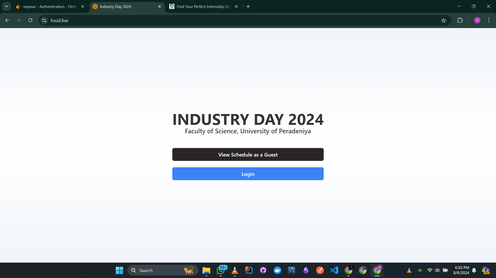
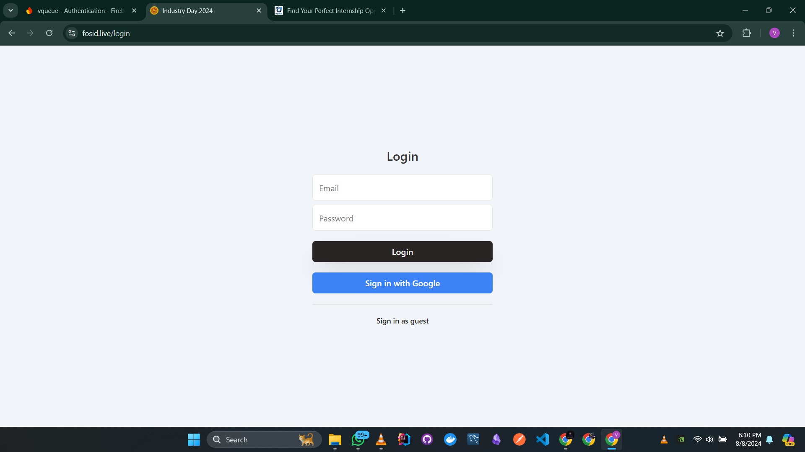
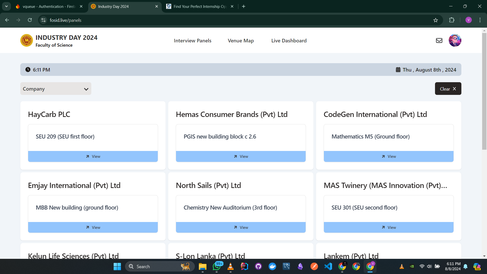
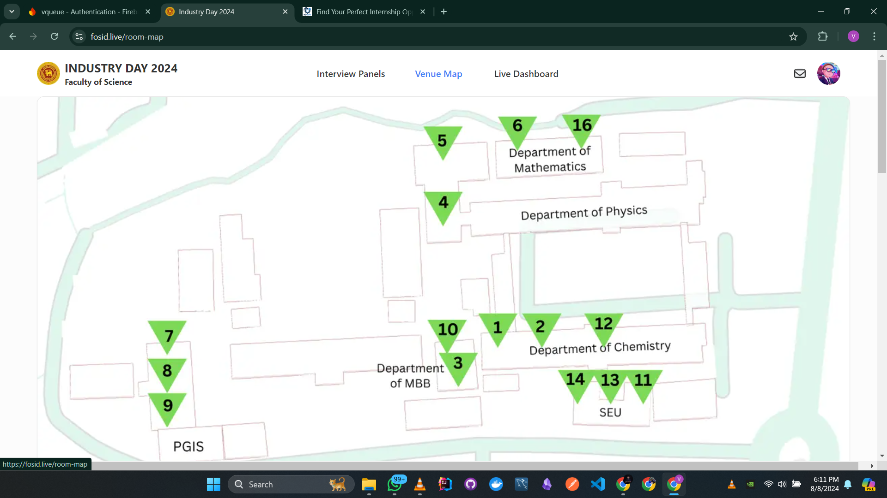
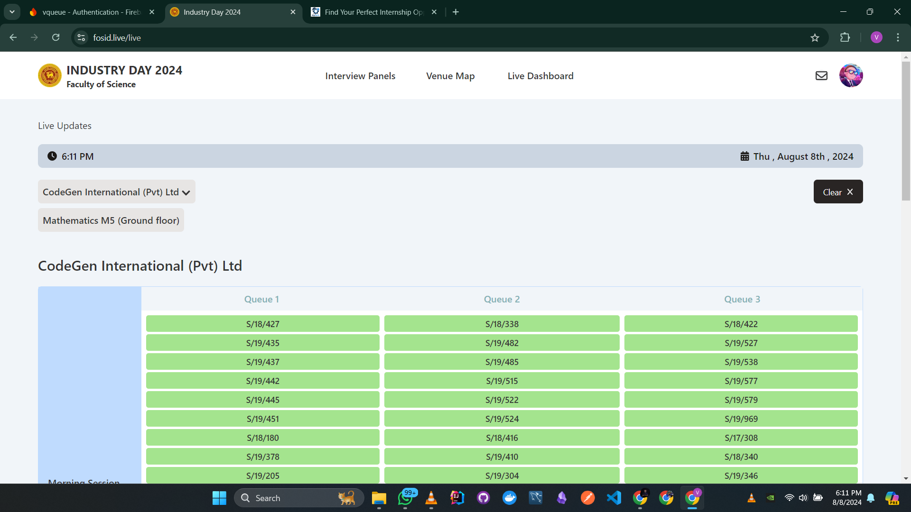
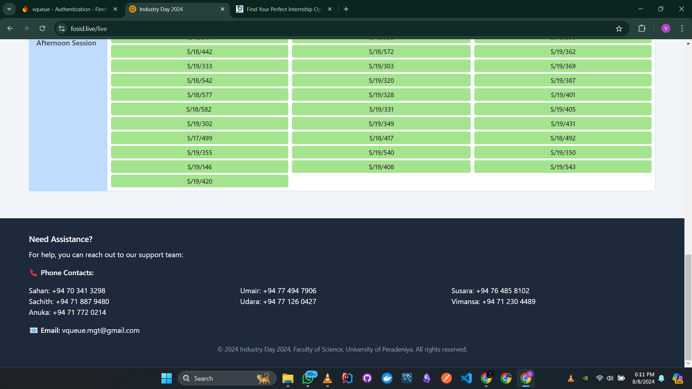

# FOSID.LIVE

Played a significant role in the team responsible for implementing this web app which was used at Industry Day - 2024 organized by the Faculty of Science - University of Peradeniya.

This Platform facilitated the smooth running of the day which included User Registration, Queue Management, Room Management etc..

## Interface
### Homepage

### Login

### Panels

### Room Map

### Live Dashboard

### Footer

---

## Collaborators:
1. Udara-Peiris
2. Sachith-953
3. anukah
4. mhmdumair
5. Wishva12

**Note:** The old working repository was lost, which is why this new repository was created. 
